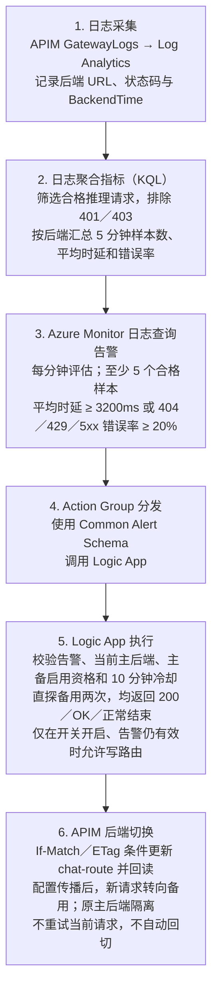

# Azure APIM 大模型统一接入与主备切换方案

**面向客户的方案介绍｜2026 年 9 月 16 日**

本文介绍大模型统一接入与主备切换的架构、接入方式、运行机制及已取得的实验结果。文中的运行状态截至 9 月 16 日 00:08 UTC，不代表文档阅读时的实时状态。本方案目前为 Azure APIM Developer 实验环境验证结果，不是生产 SLA 承诺。

## 一、方案定位与客户价值

本方案为客服等大模型应用提供一个固定的 HTTPS 入口，由 Azure API Management（APIM）统一完成接入鉴权和请求转发。应用不需要自行选择模型区域；当监控发现当前主后端持续异常时，由控制器确认备用后端可用，再更新路由，使**配置生效后的新请求**转向备用。

核心价值是将“模型调用”和“故障处置”分开：业务请求由 APIM 直接转发到 Foundry；区域选择、健康确认和路由变更集中在网关及控制链路管理，并保留可追溯记录。

**这不是失败请求的即时重试方案，也不是双活负载均衡方案。** 当前请求只转发一次；告警、备用探测及配置传播是异步过程。已经失败、超时或开始输出的请求，不会自动在另一区域重放或续传。

### 与在线客服业务的关系

原业务由 Java 编排先调用意图服务，再调用知识库服务；知识库内部包含 embedding、Azure AI Search 检索、查询改写及回答生成。客户提出知识库整体约 8 秒、完整回合 15 秒的时限。

本项目覆盖其中的**模型统一接入和后续流量切换**，没有实现或改造 Java 编排、Search 检索、业务降级或端到端预算控制。原需求中的生产网关及三个区域，也不等同于本次已部署的两地实验环境。8 秒／15 秒和单次 completion 2–4 秒的目标仍是待验收目标，不能由网关连通或切换成功推导。

对于每轮由应用携带完整对话历史的无状态调用，新请求可使用兼容的备用部署，无需网关迁移会话。若业务依赖服务端保存的 response ID、文件、任务等状态，则不适用这一假设，必须另行设计状态访问与恢复。

## 二、整体架构

业务流量：**客户端／业务服务 → APIM → 当前主 Foundry 后端**

故障处置：**APIM GatewayLogs → Log Analytics → Azure Monitor 告警 → Action Group → Logic App 直探备用 → 条件更新 APIM 路由 → 配置传播 → 新请求转向备用**

| 组件 | 职责 |
|---|---|
| APIM | 校验订阅密钥、执行限流、读取当前主路由，以托管身份向上游单次转发 |
| 两地 Foundry 部署 | 提供实际模型推理能力；目前为 East US 2 和 Sweden Central |
| Log Analytics / Azure Monitor | 按真实上游地址归属请求，聚合时延和错误，触发告警 |
| Action Group / Logic App | 接收告警、检查切换资格、直接调用备用模型、更新路由 |
| APIM `chat-route` 配置 | 保存主后端、允许使用的后端列表、版本及最近切换信息 |

Logic App 的探测直接访问固定的备用 Foundry 地址，不经过 APIM 当前主路由，避免“检查备用却实际访问主后端”。监控和控制器不在每个业务请求的同步调用链上。

当前只配置两个可信 Foundry 上游；两地聊天部署名均为 `gpt-5.1`，记录的模型版本均为 `2025-11-13`。正常请求全部使用当前主后端，不按请求轮询两地，也不按模型类型分配到独立后端。

## 三、接入方式与接口边界

### 统一入口，保留上游请求格式

网关根路径配置 GET、POST、PUT、PATCH、DELETE、HEAD、OPTIONS 七种通配操作。请求通过网关鉴权和策略后，原路径、业务查询参数及请求正文发往当前主上游，不再逐个登记业务接口。

| 使用方式 | 请求路径及关键参数 |
|---|---|
| Azure OpenAI 原生聊天 | `POST /openai/deployments/gpt-5.1/chat/completions?api-version=2024-10-21` |
| OpenAI v1 风格聊天 | `POST /openai/v1/chat/completions`，正文使用 `"model":"gpt-5.1"` |
| Responses | `POST /openai/v1/responses`，正文使用 `"model":"gpt-5.1"` |
| 聊天流式输出 | 在支持的聊天请求中设置 `"stream":true`，接收 SSE |

客户端推荐使用 `api-key` 请求头，值为 **APIM 订阅密钥，不是 Foundry Key**。原生 AzureOpenAI SDK 使用网关根地址作为 `azure_endpoint`；标准 OpenAI SDK 使用网关的 `/openai/v1/` 作为 `base_url`，并显式配置上述 `api-key` 头，不能仅依赖 SDK 默认的 Bearer 鉴权。

当前配置也接受 `subscription-key` 查询参数鉴权，但不推荐使用，避免密钥进入 URL 及相关日志。APIM 在访问模型前移除客户端鉴权信息和该查询参数，再通过托管身份获取模型访问令牌。

### “透传”不等于没有约束

APIM 不解析或重组业务 JSON，不转换 URL 中的部署名、正文中的 `model` 或 `api-version`。部署名必须在目标后端真实存在；旧部署名不会自动映射为 `gpt-5.1`。

响应不启用策略缓冲，上游状态码、业务正文及 SSE 按代理语义返回。不过，鉴权失败、限流、无有效路由及转发错误可能由网关自身返回，并非所有请求都能到达模型。当前实验策略按订阅 ID 设置 **30 次／60 秒**的共享限流，各路径和方法共用额度；网关 429 不应直接解释为模型容量不足。

这里是 HTTP 反向代理，不是逐字节 TCP 隧道；HTTP 传输分帧、逐跳头和 URL 规范化仍遵循 APIM 行为。自定义预算头会被移除，不参与超时控制。CONNECT、TRACE、WebSocket 和 gRPC 未配置；同一网关上更具体前缀的其他 API 仍可能优先匹配。

**路径可代理，不代表上游支持所有协议。** `/v1/messages` 不会被转换成 Anthropic 调用，任意供应商地址也不能由调用方指定。文件、任务、二进制或 multipart 请求不由策略解析，但其业务可用性仍取决于上游接口、权限和状态。

Embedding 没有独立固定路由，和其他路径一样使用当前主上游。记录中的 Sweden 未部署对应 embedding，因此会返回 `DeploymentNotFound`；当前方案不能作为完整知识库 embedding 高可用的交付。

## 四、故障识别与切换机制

### 从日志到后端切换的流程图

图中的“指标”是 **KQL 对 APIM 日志计算出的统计值**，由日志查询告警直接评估，不是新增的 Azure 平台指标资源，也不是 Foundry 原生指标告警。任一告警条件满足后仍须通过 Logic App 的资格校验和健康探测，才可能切换；条件不满足或探测失败时不写路由。若写入后回读失败，需核查实际路由，不能假定已回滚。

### 监控哪些请求

告警仅统计指定 APIM 资源、`ApiId=llm`、`POST` 请求，按完整 Foundry 主机及以下路径归属后端：两地配置的 `gpt-5.1/chat/completions` 部署路径、`/openai/v1/chat/completions`、`/openai/v1/responses`。查询参数不参与地址归属。

**代理范围大于告警范围。** 任意不存在路径、files/jobs、embedding 和其他未匹配路径不进入聊天切换统计；切换一旦完成，所有经该代理转发的后续路径都会使用新的主上游。

| 信号 | 当前规则 |
|---|---|
| 后端时延异常 | 同一后端 5 分钟内至少 5 个合格样本，平均 `BackendTime` ≥ 3200ms |
| 错误率异常 | 同一后端 5 分钟内至少 5 个合格样本，404／429／500–599 合计比例 ≥ 20% |
| 评估频率 | 每分钟评估一次，按后端分别判断 |

网关或后端状态码任一命中上述错误集合，该样本计为错误；任一字段为 401／403 的请求从两条健康告警的样本中排除，需要另行处理鉴权问题。400 本身不计入错误分子，但符合路径条件时仍可进入样本及平均时延统计。

规则按 HTTP 状态判断，不读取响应正文。因此，部署缺失的 404 会计入，合格推理路径上错误 `api-version` 导致的 404 也可能计入；告警归属不等于已经证明某个区域发生基础设施故障。网关前置限流等错误若缺少匹配的后端 URL，也不保证进入此统计。

低流量未达到最小样本数时可能不触发告警；没有告警不代表后端健康。`BackendTime` 是网关记录的后端耗时，不是模型纯推理时间、P95 指标或完整业务回合时间。

### 告警之后如何安全切换

1. 校验告警格式、规则名、工作区和后端维度，仅处理 `Fired` 事件，拒绝超过 10 分钟或未来时间的事件；工作流串行运行。
2. 读取最新路由及 ETag。只有告警指向当前主后端、主备均在启用列表中，且距离上次切换已满 10 分钟，才继续。
3. 对固定备用部署连续执行两次真实非流式模型请求。每次均要求 HTTP 200、唯一回答、内容严格为 `OK`、正常结束；探测 HTTP 不重试。
4. 确认自动切换开关开启、告警仍有效，以 `If-Match` 和读取到的 ETag 条件更新路由。将备用设为主、仅保留新主的启用资格、版本加一，并记录切换时间与原因。
5. 确认管理面写入及回读成功；配置传播后，由新的真实网关请求确认数据面已经转向备用。

ETag 用于防止覆盖并发更新，不是强制写入开关。探测失败、权限不足、配置冲突或保护条件不满足时，不绕过保护强行切换。写入后再出错也不代表已自动回滚，运维需要检查实际路由。

**切换后隔离原主后端，不自动恢复资格、不自动回切。** 告警恢复为 `Resolved` 不会使流量回到原区域。若只启用一个后端，就没有可自动使用的备用。

## 五、已取得的验证结果

### 接口与控制能力

以下为已有实验记录，不是本次文档编写期间重新执行的线上测试。

| 项目 | 已观察到的结果与适用范围 |
|---|---|
| 根路径通配 | 9 月 15 日七种方法对不存在的嵌套路径均返回上游 404、单次转发；证明请求进入代理，不证明真实文件／任务操作已验收 |
| 聊天、SSE、v1、Responses | 12:28 UTC 两地部署名统一后，经 Sweden 的原生聊天、SSE、v1 聊天和 Responses 均成功；12:16 的较早记录另有 SSE chunk 与 `[DONE]` 证据 |
| 参数及错误透传 | 非法版本／正文收到上游 404／400；未部署模型没有被改写到别名或其他区域 |
| 备用探测及管理权限 | 记录中两地均通过直连身份探测；控制器身份完成路由权限检查 |
| 真实错误告警闭环 | 9 月 15—16 日删除主部署后，真实 404 告警触发两次备用探测、ETag 路由更新及后续请求转向备用 |

### 最新主部署删除演练

演练持续向 APIM 发送短提示词请求，先恢复 Sweden 备用资格，再删除当时主后端 East US 2 的 `gpt-5.1`。没有手工把主路由切到备用，也没有伪造告警；使用既有 404／429／5xx 错误规则。

| 关键事件 | UTC 时间 |
|---|---|
| 主部署管理面删除成功 | 2026-09-15 23:37:58 |
| 客户端首次观察到主后端 404 | 2026-09-15 23:56:48 |
| Azure Monitor 错误告警触发 | 2026-09-16 00:03:52.839 |
| Logic App 路由写入完成 | 2026-09-16 00:04:01.097 |
| 新请求首次收到 Sweden 200（客户端请求完成） | 2026-09-16 00:04:14.172 |

| 耗时口径 | 本次实测 |
|---|---|
| 删除成功 → 首次观察到 404 | 约 18 分 49.9 秒 |
| 首次观察到 404 → 备用首个 200 | **约 7 分 25.8 秒** |
| 删除成功 → 备用首个 200 | 约 26 分 15.7 秒 |
| 告警触发 → 备用首个 200 | **约 21.33 秒** |
| 路由写入完成 → 备用首个 200 | 约 13.08 秒 |

删除成功后约 27 分 17 秒的观察中（从提交删除算起约 27 分 19 秒），共记录 322 次请求：275 次 East US 2 200、34 次 East US 2 404、13 次 Sweden 200；切换后连续 13 次备用请求成功，网关日志与客户端记录相互印证。耗时按客户端请求完成时间计算；交付记录中的首个备用成功事件时间为 00:04:14.177，比请求完成时间晚约 5 毫秒。

这些数字必须按起点理解：管理面删除成功不等于数据面立即停止服务；首次 404 后仍有 200 交替出现。首次错误到告警的时间包含错误比例形成、日志入库及评估；写入到备用响应的时间包含配置传播、采样间隔及请求耗时，不能当作纯配置传播延迟。**21.33 秒是本次“告警后”的观测，不是故障发生后 21 秒恢复的保证。**

较早一次删除演练观察约 10 分 05 秒、119 次请求全部成功，未形成可测的故障起点，不能得出切换耗时。

### 演练收尾状态

截至 9 月 16 日 00:08 UTC 的记录，East US 2 部署已按原配置恢复，两地均健康；Sweden 为主、East US 2 备用已人工重新启用，路由版本为 9，两条告警及 `switchEnabled` 均开启，未回切 East US 2。此状态是演练收尾快照，不是永久配置要求或实时健康保证。

## 六、超时、容量与业务连续性边界

APIM 当前 `forward-request timeout=120` 约束等待响应头，**不是完整响应正文、SSE 空闲时间或业务回合的截止时间**。当前没有意图／改写／生成／embedding 分类预算，`X-Remaining-Budget-Ms` 不参与超时控制。Logic App 探测也未配置细粒度的总读取或空闲超时预算。

应用仍需实现完整业务回合的超时、取消及降级；若沿用客户 fail-fast 约定，应关闭聊天 SDK 自动重试。网关不重试并不能阻止客户端 SDK 自行重试，客户端取消也不能被视为上游模型一定停止计算的证明。

SSE 已验证正常流式输出，但**流开始后不跨区域续传**。只返回过 200 响应头的中断不一定产生 5xx，现有告警不能保证检测所有流中断；客户端必须识别未完整结束的响应。

两次短探测只证明当时能完成小请求，不证明备用能承接全量业务。实验记录中的两地 GlobalStandard 容量配置不同（East US 2 为 150、Sweden 为 10）；这些是部署配置值，不是本项目测出的吞吐能力，更不能据此假定 N-1 容量已经满足。

| 能力／目标 | 当前结论 |
|---|---|
| 固定入口、单次转发、错误告警驱动后续切换 | 已实现，并有上述限定范围的连通与真实闭环证据 |
| 时延告警独立触发切换 | 规则已实现，仍需单独完成当前拓扑演练 |
| SSE 中断检测／恢复、完整 body／idle 截止 | 未验收；没有跨区域无缝续传能力 |
| Java + Search 知识库 8 秒／完整回合 15 秒 | 未验收，需真实业务端到端测量与预算控制 |
| P95／P99、持续可靠性及 N-1 容量 | 未验收，需要代表性负载和长时间观测 |
| embedding、文件／任务／服务端会话跨区域可用 | 当前不提供独立容灾或状态复制 |
| 网关自身生产高可用 | Developer 实验配置不等于生产 HA，需另行规划 SKU、网络及可用性设计 |

## 七、安全与运维要求

客户端仅持有网关订阅密钥；APIM 与 Logic App 使用用户分配托管身份访问模型。Logic App 的系统身份另用于单个 `chat-route` 资源范围的管理操作，模型权限与路由管理权限分离。

通配接口包含写入和删除方法，订阅密钥持有者可以访问模型身份有权限的上游数据面路径，不仅限聊天。生产上线前必须确认调用方范围、订阅隔离及接口授权策略；当前没有按租户或业务类型细分所有操作权限的承诺。

诊断配置不采集业务请求／响应正文或鉴权头，但仍会记录 URL、状态、耗时等元数据。不得把密钥或敏感业务内容放入查询参数；日志访问、保留期限和跨区域数据合规仍需客户审批。Logic App SAS 回调地址属于敏感凭据，告警字段校验不能替代对回调地址的保护。

变更或演练前应关闭告警与写路由开关，并确认没有在途切换；关闭告警不会取消已启动的工作流。现有 `smoke.py` 包含非法版本的负向 404 请求，虽然不直接写路由，却可能间接触发告警，必须在告警禁用期间执行。部署脚本默认关闭告警及切换开关；启用或写入失败后应读取实际状态，不能假定自动回滚。

恢复备用应先确认部署、权限和容量，再以最新 ETag 将后端加入启用列表，保留当前主路由及其他字段，随后恢复告警。健康检查本身不解除隔离；不得使用初始化路由参数代替恢复操作。

生产验收应将“业务请求能及时失败或降级”和“后续流量能切到健康备用”作为两项独立指标，分别验证。控制链路异常、无合格备用或日志缺失期间，也需有人工处置和业务降级机制。
